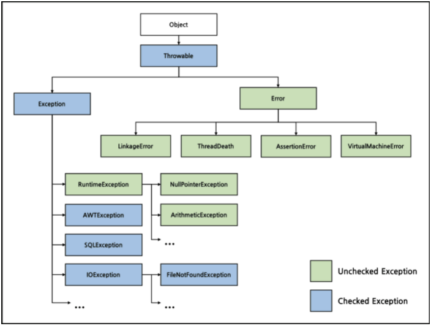

# Checked & Unchecked Exception
- 자바에서 `예외`는 어떻게 구분할까?
- `Checked Exception` vs `Unchecked Exception` 차이
___
## 예외(Exception), 에러(Error)
- <b>⭐예외(Exception)</b>
    - 입력 값에 대한 처리가 불가능하거나, 프로그램 실행 중 참조된 값이 잘못 된 경우 등 정상적인 프로그램의 흐름에 어긋나는 경우
    - 개발자가 예외 상황을 미리 예측하여 직접 핸들링할 수 있음
- <b>⭐에러(Error)</b>
    - 시스템에 어떠한 비정상적인 상황이 발생한 경우
    - 주로 JVM에서 발생하며, 예외와 반대로 이를 애플리케이션 코드에서 잡으려고 하면 안 됨
        > ex) `OutOfMemoryError`, `ThreadDeath`, `StackOverflowError`, ..
___
## 예외 구분
`RuntimeExecption`를 상속받는지 유무로 예외를 구분할 수 있다.
- <b>Checked Exception</b>
    - RuntimeException 상속❌
- <b>Unchecekd Exception</b>
    - RuntimeException 상속⭕



<table>
<tr>
<th>구분</th>
<th>Checked Exception</th>
<th>Unchecked Exception</th>
</tr>
<tr>
<td>확인 시점</td>
<td>Compile time</td>
<td>Runtime</td>
</tr>
<tr>
<td>처리 여부</td>
<td>반드시 예외 처리</td>
<td>명시적으로 하지 않아도 됨</td>
</tr>
<tr>
<td>트랜잭션 처리</td>
<td>예외 발생 시, rollback 하지 않음</td>
<td>예외 발생 시, 반드시 rollback</td>
</tr>
<tr>
<td>종류</td>
<td>IOException<br>
ClassNotFoundEception<br>
...</td>
<td>NullPointerException<br>
ClassCastException<br>
...</td>
</tr>
</table>

___
## 예외 처리
예외를 처리하는 방법은 `예외 복구`, `예외 처리 회피`, `예외 전환`이 있다.
### 예외 복구
- 예외 상황을 파악하고, 문제를 해결하여 정상 상태로 돌려 놓는 방법
- 예외를 잡아 일정 시간, 조건만큼 대기하고, 다시 재시도를 반복
- 최대 재시도 횟수를 넘기게 되는 경우, 예외를 발생
```java
final int MAX_RETRY = 100;
public Object someMethod() {
    int maxRetry = MAX_RETRY;
    while(maxRetry > 0) {
        try {
            ...
        } catch(SomeException e) {
            // 로그 출력. 정해진 시간만큼 대기한다.
        } finally {
            // 리소스 반납 및 정리 작업
        }
    }
    // 최대 재시도 횟수를 넘기면 직접 예외를 발생시킨다.
    throw new RetryFailedException();
}
```
### 예외 처리 회피
- 예외 처리를 직접 담당하지 않고, 호출한 쪽으로 던져 회피
- 어느 정도는 예외를 처리하고 던지는 것이 좋음
- 긴밀하게 역할을 분담하고 있는 관계가 아니라면, 예외를 그냥 던지는 것은 무책임
```java
// 예시 1
public void add() throws SQLException {
    // ...생략
}

// 예시 2 
public void add() throws SQLException {
    try {
        // ... 생략
    } catch(SQLException e) {
        // 로그를 출력하고 다시 날린다!
        throw e;
    }
}
```
### 예외 전환
- 예외 회피와 비슷하게 메소드 밖으로 예외를 던지지만, 그냥 던지지 않고, 적절한 예외로 전환하여 던지는 방법
- 조금 더 명확한 의미로 전달되기 위해, 적합한 의미를 가진 예외로 변경
- 예외 처리를 단순하게 만들기 위해 포장(wrap)할 수도 있음
```java
// 조금 더 명확한 예외로 던진다.
public void add(User user) throws DuplicateUserIdException, SQLException {
    try {
        // ...생략
    } catch(SQLException e) {
        if(e.getErrorCode() == MysqlErrorNumbers.ER_DUP_ENTRY) {
            throw DuplicateUserIdException();
        }
        else throw e;
    }
}

// 예외를 단순하게 포장한다.
public void someMethod() {
    try {
        // ...생략
    }
    catch(NamingException ne) {
        throw new EJBException(ne);
        }
    catch(SQLException se) {
        throw new EJBException(se);
        }
    catch(RemoteException re) {
        throw new EJBException(re);
        }
}
```