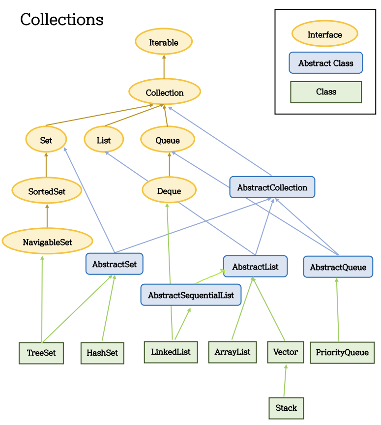
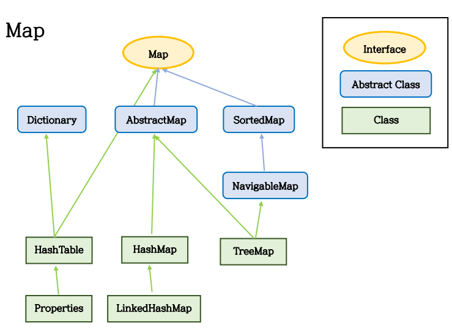

# Collection Framework



## 주요 인터페이스 특징
### List
- 순서가 있는 데이터의 집합.
- 데이터의 중복을 허용함.
- 구현 클래스
    - `LinkedList`
    - `Stack`
    - `Vector`
        - 동기화 보장 o
        ```java
        List list = Collections.synchronizeList(new ArrayList(...));
        ```
    - `ArrayList`
        - 동기화 보장 x
- List 클래스 주요 메소드
    - `boolean add(E e)` : 주어진 객체를 맨 끝에 추가
    - `void add(int index, E element)` : 주어진 index에 객체를 추가
    - `set(int index, E element)` : 주어진 index에 저장된 객체를 주어진 객체로 변경
    - `boolean contains(Object o)` : 주어진 객체가 저장되어 있는지에 대한 여부를 반환
    - `E get(int index)` : 주어진 index에 저장된 객체를 반환
    - `boolean isEmpty()` : 컬렉션이 비어있는지 여부를 반환
    - `int size()` : 저장되어 있는 객체 수를 반환
    - `E remove(int index)` : 주어진 index에 저장된 객체를 삭제
    - `void clear()` : 컬렉션에 저장된 전체 객체를 삭제
    - `boolean remove(Object o)` : 주어진 객체를 삭제
### Set
- 순서를 유지하지 않는 데이터의 집합.
-  데이터의 중복을 허용하지 않음.
- 구현 클래스
    - `HashSet`
        - Set계열의 대표 클래스
    - `TreeSet`
        - 정렬을 위한 Set계열의 클래스
- Set 클래스 주요 메소드
    - `boolean add(E e)` : 주어진 객체를 저장 후, 성공적이면 true, 중복 객체면 false를 반환
    - `boolean contains(Object o)` : 주어진 객체가 저장되어 있는지에 대한 여부를 반환
    - `Iterator<E> iterator()` : 저장된 객체를 한 번씩 가져오는 반복자를 반환
    - `boolean isEmpty()` : 컬렉션이 비어있는지에 대한 여부를 반환
    - `int size()` : 저장되어 있는 객체 수를 반환
    - `void clear()` : 컬렉션에 저장된 전체 객체를 삭제
    - `boolean remove(Object o)` : 주어진 객체를 삭제
### Map
- (key, value)의 쌍으로 이루어진 데이터의 집합.
- 순서는 유지되지 않고, key는 중복을 허용하지 않으며, value의 중복은 허용함.
- 구현 클래스
    - `HashMap`
        - 동기화 보장 x
    - `HashTable`
        - 동기화 보장 o
        ```java
        Map m = Collections.synchronizedMap(New HashMap(...));
        ```
    - `TreeMap`
        - 정렬을 위한 Map계열의 클래스
    - `Properties`
        - HashTable의 하위 클래스
        - 파일 입출력 지원
- Map 클래스 주요 메소드
    - `V put(K key, V value)` : 주어진 key와 value를 추가하여, 저장되면 value를 반환
    - `boolean containsKey(Object Key)` : 주어진 key가 컬렉션에 존재하는지 여부를 반환
    - `boolean containsValue(Object value)` : 주어진 value가 컬렉션에 존재하는지 여부를 반환
    - `Set<Map, Entry<K,V>> entrySet()` : 모든 Map, Entry 객체를 Set에 담아 반환
    - `Set<K> keySet()` : 모든 key를 Set객체에 담아서 반환
    - `V get(Object Key)` : 주어진 key에 있는 value를 반환
    - `boolean isEmpty()` : 컬렉션이 비어있는지에 대한 여부를 반환
    - `int size()` : 저장되어 있는 객체 수를 반환
    - `Collection<V> values()` : 저장된 모든 value를 컬렉션에 담아서 반환
    - `void clear()` : 저장된 모든 Map, Entry를 삭제
    - `V remove(Object Key)` : 주어진 key와 일치하는 Map, Entry를 삭제하고 value를 반환