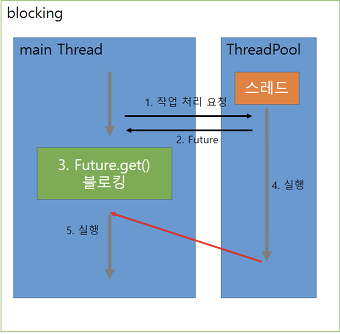

# Callable, Future
## Callable
- `Runnable`과 유사하지만, 작업의 `결과`를 받을 수 있다.
    - Runnable 구현 클래스
    ```java
    Runnable task = new Runnable(){
        @Override
        public void run(){
            // code
        }
    };
    ```
    - `Callable` 구현 클래스
    ```java
    Callable<T> task = new Callable<T>(){
        @Override
        public T call() throws Exception{
            // code

            return T;
        }
    };
    ```
## Future
- 비동기적인 작업의 현재 상태를 `조회`하거나, `결과`를 가져올 수 있다.
- 작업이 완료될 때 까지 기다렸다가 최종 결과를 얻는 데 사용하므로, `지연 완료(pending completion) 객체`라고 한다.
    - 
    - `get()` 메소드를 호출하면, thread가 작업을 완료할 때 까지 blocking되었다가, 작업을 완료하면 결과를 return한다.
### 주요 메소드
- ```java
  ExecutorService executorService = Executors.newSingleThreadExecutor();

  Callable<String> hello = () ->{
      Thread.sleep(2000L);
      return "Hello";
  };

  Future<String> helloFuture = executorService.submit(hello);
  System.out.println(helloFuture.isDone()); // false
  System.out.println("Started!");
  
  String s = helloFuture.get(); // 작업이 완료될 때 까지 blocking
  System.out.println(s); // "Hello"
  
  // true인 경우, 현재 수행중인 작업을 interrupt하고 종료
  // false인 경우, 기다렸다가 종료
  // cancel하면, get으로 가져올 수 없다.
  // 종료되었으므로, isDone()이 true를 리턴한다.
  helloFuture.cancel(true);
  
  System.out.println(helloFuture.isDone()); // true
  System.out.println("End!!");
  executorService.shutdown();
  ```
- `submit`
    - Runnable or Callable을 작업 큐에 저장하고, 반환된 Future를 통해 작업 처리 결과를 얻음
        1. `Future<?> submit(Runnable task)`
        2. `Future<V> submit(Runnable task, V result)`
        3. `Future<V> submit(Callable<V> task)`

- `get`
    - 작업이 완료될 때 까지 blocking 되었다가, 처리 결과 V를 return한다. (`Blocking Call`)
        1. `V get()`
    - timeout안에 작업이 완료되면 결과 V를 return하지만, 완료되지 않으면 throw TimeoutException.
        1. `V get(long timeout, TimeUnit unit)`
- 상태 관련 메소드
    - 작업 처리가 진행 중일 경우 취소시킨다.
        1. `boolean cancel(Boolean mayInterruptIfRunning)`
            - parameter가 true인 경우, 현재 진행중인 thread를 interrupt시킨다.
            - parameter가 false인 경우, 진행중인 작업이 끝날 때까지 기다린다.
    - 작업이 취소되었는지 여부를 확인한다.
        1. `boolean isCancelled()`
    - 작업 처리가 완료되었는지 여부를 확인한다.
        1. `boolean isDone()`
- `invoke`
- ```java
  ExecutorService executorService = Executors.newFixedThreadPool(3);

  Callable<String> hello = () ->{
      Thread.sleep(2000L);
      return "Hello";
  };
  Callable<String> java = () ->{
      Thread.sleep(3000L);
      return "Java";
  };
  Callable<String> seonpil = () ->{
      Thread.sleep(1000L);
      return "Seonpil";
  };

  // invokeAny는 blocking call이고, 가장 먼저 끝나는 작업을 string으로 반환된다.
  String s = executorService.invokeAny(Arrays.asList(hello, java, seonpil));
  System.out.println(s);    // seonpil

  // invokeAll은 모든 작업이 끝날 때 까지 기다린 다음에, 모든 결과를 반환한다.
  List<Future<String>> futures = executorService.invokeAll(Arrays.asList(hello, java, seonpil));
  for(Future<String> f : futures){
      System.out.println(f.get());  // seonpil hello java
  }

  executorService.shutdown();
  ```
    - 여러 작업 동시에 실행하기(invokeAll)
        1. `List<Future<T>> invokeAll(Collection<? extends Callable<T>> tasks)`
        2. `List<Future<T>> invokeAll(Collection<? extends Callable<T>> tasks, long timeout, TimeUnit unit)`
            - 동시에 실행한 작업 중에 가장 오래 걸리는 작업의 시간만큼 소요된다.
    - 여러 작업 중에 먼저 응답이 오는 작업이 있으면 끝내기(invokeAny)
        1. `T invokeAny(Collection<? extends Callable<T>> tasks)`
        2. `T invokeAny(Collection<? extends Callable<T>> tasks, long timeout, TimeUnit unit)`
            - 동시에 실행한 작업 중에 가장 짧게 걸리는 작업의 시간만큼 소요된다.
            - `Blocking Call`이다.