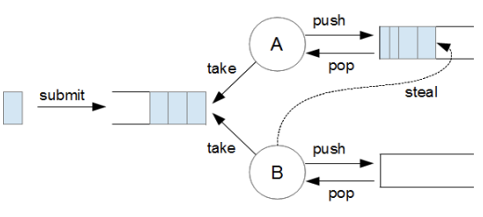
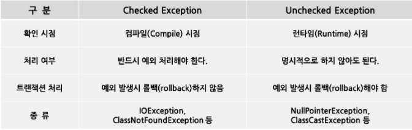

# CompletableFuture
- Java 8 에서 `비동기(Asynchronous) 프로그래밍`을 가능하게 하는 인터페이스
- Java 7의 `Fork/Join framework` 기반으로 만들어졌다.
    - `ExecutorService` 기반으로 만들어졌다.
    - 재귀적으로 더 작은 크기로 쪼갤 수 있는 task를 효율적으로 처리하기 위해 만들어졌다.
    - ExecutorService와 다른 특징으로는 `work-stealing`이 있다.
    - 
    - Thread pool에 있던 thread A에 과부하가 걸려서 thread A 내부 큐가 가득 차있을 때, <br>thread pool에 있는 다른 thread B가 과부하 걸린 thread A 내부 큐에 있는 task를 가져와서 처리할 수 있다.
- Future로는 하기 어려웠던 작업들을 가능하게 해준다.
    1. Future를 외부에서 완료시킬 수 없다.
        - 취소하거나, get()에 timeout을 설정하는 것만 가능했다.
    2. Blocking code(get())를 사용하지 않고서는, 작업이 끝났을 때 콜백(call back)을 실행할 수 없다.
    3. 여러 Future를 조합할 수 없다.
        > ex) Event 정보를 가져온 다음, Event에 참석한 회원 목록을 가져오기
    4. 예외 처리용 API를 제공하지 않는다.
- 개선된 점
    - 더 개선된 함수형 프로그래밍 style 도입
    - logic을 조립(compose)하고, 결과를 모아서 처리(combine)하고, 비동기 연산 과정을 실행하고, 에러를 처리할 수 있는 50여개의 메소드 추가.
    - CompletableFuture의 API 대부분은 `Async` 접미사가 붙은 것과 붙지 않은 것으로 나누어져있다.
        - `Async` 접미사가 붙은 메소드는 해당 연산을 다른 thread에서 실행하려고 할 때 사용된다.
- [CompletableFuture](https://docs.oracle.com/javase/8/docs/api/java/util/concurrent/CompletableFuture.html)
    - Implements Future
    - Implements [CompletionStage](https://docs.oracle.com/javase/8/docs/api/java/util/concurrent/CompletionStage.html)

## 비동기로 작업 실행하기
```java
CompletableFuture<String> future = new CompletableFuture<>();
future.complete("seonpil"); // future의 기본 값을 "seonpil" 으로 설정
String s1 = future.get(); // future의 작업이 끝날 때 까지 blocking
System.out.println(s1);

// static factory method
CompletableFuture<String> seonpil = CompletableFuture.completedFuture("seonpil");
System.out.println(seonpil.get());
```
### return 값이 없는 경우
- `runAsync()`
```java
CompletableFuture<Void> voidCompletableFuture = CompletableFuture.runAsync(() -> {
    System.out.println("Hello " + Thread.currentThread().getName());
});
voidCompletableFuture.get();
```

### return 값이 있는 경우
- `supplyAsync()`
```java
CompletableFuture<String> stringCompletableFuture = CompletableFuture.supplyAsync(() -> {
    System.out.println("Hello " + Thread.currentThread().getName());
    return "Hello";
});
System.out.println(stringCompletableFuture.get());
```
### Fork-Join Framework
- CompletableFuture은 내부적으로 `ForkJoinPool.commonPool()`이 존재하기 때문에 따로 thread pool을 사용하지 않아도 된다.
- 원한다면 Executor을 사용해서 실행할 수도 있다.
```java
/*
* CompletableFuture는 Executors를 사용하지 않아도, 내부적으로 Fork-Join pool에 있는 common pool을 사용하게 된다.
* 하지만, 원한다면 얼마든지 Executors를 만들어서 runAsync, supplyAsync의 두번째 parameter에 넣어 사용할 수도 있다.
* 또한, thenRun, thenApply, thenAccept 뒤에 Async를 붙여서 두 번째 parameter에 Executors를 넣어 사용할 수도 있다.
* */
ExecutorService executorService = Executors.newFixedThreadPool(4);
CompletableFuture<Void> voidCompletableFuture3 = CompletableFuture.supplyAsync(() -> {
    System.out.println("Hello " + Thread.currentThread().getName());
    return "Hello";
}, executorService).thenRunAsync(()->{
    System.out.println(Thread.currentThread().getName());
}, executorService);
voidCompletableFuture3.get();
executorService.shutdown();
```

## 콜백(Call-back) 제공하기
- 콜백의 장점은 `비동기 계산`을 수행할 때, `결과를 기다리지 않고 다음 작업을 정의`할 수 있다는 데 있다.<br><br>
- `thenApply(Function)`
    - return 값을 받아서 다른 값으로 바꾸어 return 하는 콜백 함수
```java
ompletableFuture<String> stringCompletableFuture1 = CompletableFuture.supplyAsync(() -> {
    System.out.println("Hello " + Thread.currentThread().getName());
    return "Hello";
}).thenApply(s -> {
    System.out.println(Thread.currentThread().getName());
    return s.toUpperCase();
});
System.out.println(stringCompletableFuture1.get());
```
- `thenAccept(Consumer)`
    - return 값을 받아서 다른 작업을 처리하고 return 하지 않는 콜백 함수
```java
CompletableFuture<Void> voidCompletableFuture1 = CompletableFuture.supplyAsync(() -> {
    System.out.println("Hello " + Thread.currentThread().getName());
    return "Hello";
}).thenAccept(s -> {
    System.out.println(Thread.currentThread().getName());
    System.out.println(s.toUpperCase());
});
voidCompletableFuture1.get();
```
- `thenRun(Runnable)`
    - return 값을 받지 않고 다른 작업을 처리하고 return 하지 않는 콜백 함수
```java
CompletableFuture<Void> voidCompletableFuture2 = CompletableFuture.supplyAsync(() -> {
    System.out.println("Hello " + Thread.currentThread().getName());
    return "Hello";
}).thenRun(() -> {
    System.out.println(Thread.currentThread().getName());
});
voidCompletableFuture2.get();
```
- 콜백 자체를 다른 thread에서 실행할 수도 있다.

## 조합하기
- `thenCompose()`
    - 두 작업이 서로 이어서 실행하도록 조합
    ```java
    // 두 Futures 간에 의존성이 있는 경우
    CompletableFuture<String> hello = CompletableFuture.supplyAsync(() -> {
        System.out.println("Hello " + Thread.currentThread().getName());
        return "Hello";
    });
    CompletableFuture<String> future = hello.thenCompose(App2::getWorld);
    System.out.println(future.get());
    ```
    ```java
    private static CompletableFuture<String> getWorld(String msg) {
        return CompletableFuture.supplyAsync(() -> {
            System.out.println("World " + Thread.currentThread().getName());
            return msg + " World";
        });
    }
    ```
- `thenCombine()`
    - 두 작업을 독립적으로 실행하고, 둘 다 종료했을 때 콜백 실행
    ```java
    // 서로 연관관계가 없는 경우
    CompletableFuture<String> hello = CompletableFuture.supplyAsync(() -> {
        System.out.println("Hello " + Thread.currentThread().getName());
        return "Hello";
    });
    CompletableFuture<String> world = CompletableFuture.supplyAsync(() -> {
        System.out.println("World " + Thread.currentThread().getName());
        return "World";
    });
    CompletableFuture<String> future = hello.thenCombine(world, (h, w) -> h + " " + w);
    System.out.println(future.get());
    ```
- `allOf()`
    - 여러 작업을 모두 실행하고, 모든 작업 결과에 콜백 실행
    ```java
    CompletableFuture<Void> future1 = CompletableFuture.allOf(hello, world);
    System.out.println(future1.get());  // null이 출력된다.
    // 각 Future가 반환하는 타입이 항상 동일하다는 보장도 없을 뿐더러, 에러가 나지 않음을 보장할 수도 없기 때문이다.
    // 즉, 결과값이 무의미하다.
    ```
    ```java
    // 결과값을 제대로 받고 싶다면?
    List<CompletableFuture<String>> futures = Arrays.asList(hello, world);
    CompletableFuture[] futuresArray = futures.toArray(new CompletableFuture[futures.size()]);
    CompletableFuture<List<String>> results = CompletableFuture.allOf(futuresArray)
            .thenApply(v -> futures.stream()
                        .map(CompletableFuture::join)
                        .collect(Collectors.toList()));
    results.get().forEach(System.out::println);
    ```
    - `join()`
        - `get()`과 동일하지만, `Unchecked Exception`을 throw한다.
        - join대신 get을 사용하려면, try-catch구문으로 반드시 감싸주어야 한다.
        - 
- `anyOf()`
    - 여러 작업 중에 가장 빨리 끝난 하나의 결과에 콜백 실행
    ```java
    CompletableFuture<Void> future = CompletableFuture.anyOf(hello, world)
            .thenAccept(System.out::println);
    future.get();
    ```
    - 계속 실행하다 보면, Hello와 World가 랜덤으로 번갈아가며 출력되는 것을 확인할 수 있다.

## 예외처리
- `exceptionally(Function)`
```java
boolean throwError = true;
CompletableFuture<String> Hello = CompletableFuture.supplyAsync(() -> {
    if (throwError)
        throw new IllegalArgumentException();
    System.out.println("Hello " + Thread.currentThread().getName());
    return "Hello";
}).exceptionally(ex -> {
    System.out.println(ex);
    return "Error!";
});
System.out.println(Hello.get());
```
- `handle(BiFunction)`
    - exceptionally보다 general한 메소드이다.
    - 정상적으로 종료했을 때와, 에러가 발생했을 때의 두 경우 모두 사용할 수 있다.
    - 첫 번째 parameter는 정상적인 경우의 결과값, 두 번째 parameter는 예외가 발생했을 경우의 넘길 값을 넣어준다.
```java
boolean throwError = true;
CompletableFuture<String> Hello = CompletableFuture.supplyAsync(() -> {
    if (throwError)
        throw new IllegalArgumentException();
    System.out.println("Hello " + Thread.currentThread().getName());
    return "Hello";
}).handle((result, ex)->{
    if(ex != null){
        System.out.println(ex);
        return "Error!";
    }
    return result;
});
System.out.println(Hello.get());
```