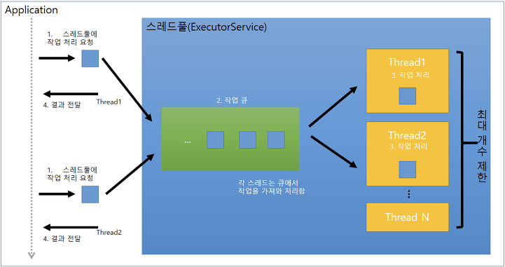

# Executors
## High-Level Concurrency 프로그래밍
- Thread를 생성, 관리하는 작업을 application에서 분리하여 Executors에게 위임한다.

## Executors가 하는 일

- Thread 생성 : application이 사용할 `Thread Pool`을 만들고 관리한다.
    - `Thread Pool`
        - 병렬 작업의 극대화로 인한 thread 증폭을 막기 위해 도입.
            - `Thread 증폭의 문제점`
                1. Thread 생성/삭제 및 scheduling overhead
                2. Thread 생성에 따른 메모리 사용량 증가
                3. Application 성능 저하
        - 작업 처리에 사용되는 thread를 `제한된 개수`만큼 정해놓고, 작업 큐에 들어오는 작업들을 하나씩 thread가 맡아 처리.
        - 작업 처리가 끝난 thread는 다시 작업 큐에서 새로운 작업을 가져와 처리.
- Thread 관리 : thread 생명 주기를 관리한다.
- 작업 처리 및 실행 : thread로 실행할 작업을 제공할 수 있는 API를 제공한다.

## 주요 인터페이스
- `Executor`
    - `void execute(Runnable)`
        - Runnable을 작업 큐에 저장
        - 작업 처리 결과를 반환하지 않는다.
        - 작업 처리 도중 예외가 발생하면, 스레드가 종료되고, 해당 스레드는 스레드 풀에서 제거된다.
        - 다른 작업을 처리하기 위해 새로운 스레드를 생성한다.
    - `Future<T> submit(Runnable)`
        - Runnable or Callable을 작업 큐에 저장
        - 작업 처리 결과를 반환한다.
        - 작업 처리 도중 예외가 발생하더라도, 스레드는 종료되지 않고 다음 작업을 위해 재사용된다.
        - 스레드의 생성 overhead를 방지하기 위해서 가급적 submit()을 사용하자.
    - `void shutdown()`
        - 현재 처리중인 작업 뿐만 아니라, 작업 큐에 대기하고 있는 모든 작업을 처리한 뒤에 thread pool을 종료시킨다.
    - `List<Runnable> shutdownNow()`
        - 현재 작업 처리 중인 thread를 interrupt해서 작업 중지를 시도하고, thread pool을 종료시킨다.
        - return value는 작업 큐에 있는 미처리된 작업의 목록이다.
    - `Boolean awaitTermination(long timeout, TimeUnit unit)`
        - shutdown() 메소드 호출 이후, 모든 작업 처리를 timeuout 시간 내에 완료했으면 true를 return, 그렇지 못하면 작업 처리 중인 thread를 interrupt하고 false를 return한다.
- `ExecutorService`
    - `Executor`를 상속받은 인터페이스로, `Callable`도 실행할 수 있으며, Executor를 종료시키거나, 여러 Callable을 동시에 실행하는 등의 기능을 제공한다.
    - ExecutorService 생성
        1. `newCachedThreadPool()`
            - ```java
              ExecutorService executorService = Executors.newCachedThreadPool();
              private static Runnable getRunnable(String message){
                return () -> System.out.println(message + Thread.currentThread().getName());
              }
              executorService.submit(getRunnable("Thread"));
              executorService.shutdown();
              ```
            - 초기 thread, 코어 thread 수는 0개이고, thread 개수보다 작업 개수가 많으면 new thread를 생성하여 작업을 처리한다.
            - 이론적으로는 Integer.MAX_VALUE만큼 thread를 추가할 수 있지만, OS의 성능과 상황에 따라 다를 수 있다.
            - 60초 동안 아무 작업을 하지 않는 thread는 종료되며, thread pool에서 제거된다.
        2. `newFixedThreadPool(int nThreads)`
            - ```java
              int nThreads; // 1 이상 자연수
              ExecutorService executorService = Executors.newFixedThreadPool(nThreads);
              ExecutorService executorService = Executors.newFixedThreadPool(Runtime.getRuntime().availableProcessors()); // CPU 코어의 수만큼 최대 thread를 사용하는 thread pool 생성
              private static Runnable getRunnable(String message){
                return () -> System.out.println(message + Thread.currentThread().getName());
              }
              executorService.submit(getRunnable("Thread"));
              executorService.shutdown();
              ```
            - 초기 thread 수는 0개, 코어 thread 수는 nThreads이고, thread 개수보다 작업 개수가 많으면 new thread를 생성하여 작업을 처리한다.
            - 최대 사용되는 threads 개수는 nThreads이다.
            - 놀고있는 thread가 있어도 thread를 pool에서 제거하지 않는다.
        3. `newSingleThreadExecutor()`
            - ```java
              ExecutorService executorService = Executors.newSingleThreadExecutor();
              private static Runnable getRunnable(String message){
                return () -> System.out.println(message + Thread.currentThread().getName());
              }
              executorService.submit(getRunnable("Thread"));
              executorService.shutdown();
              ```
            - thread가 1개인 ExecutorService를 반환하며, single thread에서 동작해야 하는 작업을 처리할 때 사용한다.
- `ScheduledExecutorService`
    - ExecutorService를 상속받은 인터페이스로, `특정 시간 이후` 또는 `주기적`으로 작업을 실행할 필요가 있을 때 사용한다.
    - ScheduledExecutorService 생성
        1. `newScheduledThreadPool(int)`
            - ```java
              int nThreads; // 1 이상 자연수
              ScheduledExecutorService scheduledExecutorService = Executors.newScheduledThreadPool(nThreads);
              ```
            - `newFixedThreadPool`와 동일한 특징을 갖는다.
        2. `newSingleThreadScheduledExecutor()`
            - ```java
              ScheduledExecutorService scheduledExecutorService = Executors.newSingleThreadScheduledExecutor();
              ```
            - `newSingleThreadExecutor()`와 동일한 특징을 갖는다.
    - `schedule(Runnable command, long delay, TimeUnit unit)`
        - ```java
          private static Runnable getRunnable(String message){
                return () -> System.out.println(message + Thread.currentThread().getName());
          }
          scheduledExecutorService.schedule(getRunnable("Hello"), 2, TimeUnit.SECONDS);
          scheduledExecutorService.shutdown();
          ```
        - 지정한 delay 이후에 command를 처리한다.
        - Runnable 대신 `Callable<V>`도 가능하다.
    - `scheduleAtFixedRate(Runnable command, long initialDelay, long period, TimeUnit unit)`
        - ```java
          private static Runnable getRunnable(String message){
                return () -> System.out.println(message + Thread.currentThread().getName());
          }
          scheduledExecutorService.scheduleAtFixedRate(getRunnable("Hello"), 1, 2, TimeUnit.SECONDS);
          scheduledExecutorService.shutdown();
          ```
        - initialdelay 이후, 첫 번째 command 실행을 시작으로, 지정한 시간(period)마다 command를 반복 실행한다.
    - `scheduleWithFixedDelay(Runnable command, long initialDelay, long period, TimeUnit unit)`
        - ```java
          private static Runnable getRunnable(String message){
                return () -> System.out.println(message + Thread.currentThread().getName());
          }
          scheduledExecutorService.scheduleWithFixedDelay(getRunnable("Hello"), 1, 2, TimeUnit.SECONDS);
          scheduledExecutorService.shutdown();
          ```
        - initialdelay 이후, 첫 번째 command 실행을 시작으로, `command의 동작이 종료된 이후` 지정한 시간(period)마다 command를 반복 실행한다.
        - 즉, command의 종료 시간 차이에 따라 주기가 변경된다.

- `Fork` / `Join` 프레임워크 (Java 7)
    - ExecutorService의 구현체로, 손쉽게 `멀티 프로세서`를 활용할 수 있도록 도와준다.