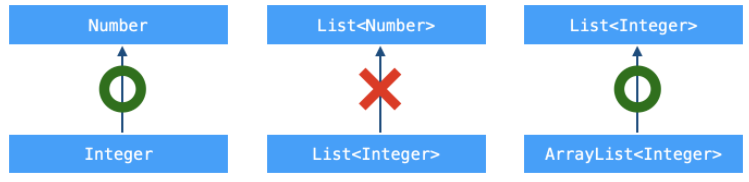

# Generic Method & Wild card

## Generic
- `제네릭(Generic)`이란, date type을 일반화하는 것을 의미한다.
- 클래스나 메소드에서 사용할 내부 데이터 타입을 `컴파일 시점에 지정`하는 방법이다.
    - 장점
        1. 클래스나 메소드 내부에서 사용되는 객체의 `타입 안정성`을 높일 수 있다.
        2. 반환값에 대한 타입 변환 및 타입 검사에 들어가는 노력을 줄일 수 있다.
```java
class MyArray<E>{
    E element;
    void setElement(E element){
        this.element = element;
    }
    E getElement(){
        return this.element;
    }
}
```
- 위에서 사용된 `E`를 `타입 변수(type variable)`라고 하며, 임의의 참조형 타입을 의미한다.
- 제네릭 클래스를 사용할 때, 반드시 < > 내부에 타입을 명시해주어야 한다.
    - 명시할 타입은 반드시 `Wrapper` 클래스를 사용하여야 한다.
```java
MyArray<Integer> myArr = new MyArray<Integer>();
```
- 또한, Java SE 7부터 instance 생성 시, 타입을 추정할 수 있는 경우에 타입 생략이 가능하다.
```java
MyArray<Integer> myArr = new MyArray<>();
```

### 타입 변수의 제한
- `extends` 키워드를 사용하여 타입 변수에 특정 타입만을 사용하도록 제한할 수 있다.
    - 아래 예시는 `자신을 포함한 자식 클래스` 타입만 사용하도록 제한하는 코드이다.
```java
class AnimalList<T extends LandAnimal> { ... }
```
- 인터페이스를 구현할 경우에도 `extends` 키워드를 사용해야 한다.
- 클래스와 인터페이스를 동시에 상속받고 구현해야 하는 경우 `&` 기호를 사용한다.
```java
class AnimalList<T extends LandAnimal & WarmBlood> { ... }
```

## Generic Method
- `제네릭 메소드(Generic Method)`란, 메소드의 선언부에 타입 변수를 사용한 메소드를 의미한다.
    - 이 때, 타입 변수의 선언은 메소드 선언부에서 반환 타입 앞에 위치한다.
```java
public static <T> void sort( ... ) { ... }
```
- 정적 메소드는 instance를 생성하지 않고도 사용이 가능하다.
    - 그러므로, 제네릭 클래스에서 정의된 타입 변수 T와 제네릭 메소드에서 사용된 타입 변수 T는 별개의 것임을 주의하자.
```java
class AnimalList<T>{
    ...
    public static <T> void sort(List<T> list, Comparator<? super T> comp) { ... }
    ...
}
```

## Wildcard
- `와일드 카드(Wild card)`란, 이름에 제한을 두지 않음을 표현하는 데 사용되는 기호를 의미한다.
- 문법
    - `<?>` : 타입 변수에 모든 타입을 사용할 수 있음
    - `<? extends T>` : T 타입과 T 타입을 상속받는 자식 클래스 타입만을 사용할 수 있음
    - `<? super T>` : T 타입과 T 타입이 상속받은 부모 클래스 타입만을 사용할 수 있음
- 예시
```java
static void printCollection(Collection<Object> c) {
    for (Object e : c) {
        System.out.println(e);
    }
}
public static void main(String[] args) {
    Collection<Integer> c = new ArrayList<>();
    c.add(123);
    printCollection(c); // Compile error
}
```
- Object는 분명 Integer의 상위 클래스인데, 왜 에러가 날까?
    - 답은 간단하다, Collection\<Object>가 Collection\<Integer>의 상위 클래스가 아니기 때문이다.
    - 
```java
static void printCollection(Collection<? extends Number> c) { 
// Number 클래스를 포함한 모든 하위 클래스만을 Collection의 타입 변수로 허용한다는 의미
    for (Number e : c) {
        System.out.println(e);
    }
}
public static void main(String[] args) {
    Collection<Integer> c = new ArrayList<>();
    c.add(123);
    printCollection(c);
}
```
- 위의 예시와 같이, 와일드 카드는 `다형성`을 실현시킨다.<br><br><br>
- 다음 예시를 보자.
```java
public static <T extends Object & Comparable<? super T>> T max(Collection<? extends T> coll)
```
- 우선, `T extends Object & Comparable<? super T>`에서 왜 `extends Object`를 하였을까?
    - 만약, extends Object를 빼고, `T Comparable<? super T>`만 있었다고 가정해보자.
    - 컴파일 시에 generic을 제거하면 `public static Comparable max(Collection coll)`이 될 것이다.
    - 하지만 우리가 원하는 것은 `public static Object max(Collection coll)`이다.
    - 즉, `Multiple bound`을 하는 경우, 첫 번째 타입으로 erasure가 작동하므로, 원하는 타입으로 반환시키기 위해 첫 번째 타입으로 Object를 추가하여 max 메소드의 타입 변수를 `Multiple bound`형태로 구현한 것이다.
- 그렇다면, `Comparable<? super T>`은 무슨 의미일까?
    - `Comparable<T>`으로만 사용하면 되는 것 아닌가?
    - 이 또한 상속을 이용한 `다형성`의 이점을 위함이다.
        - 예를들어, Person 클래스와 이를 상속받는 Student 클래스가 구현되었다고 가정해보자.
        - Person 클래스에서 `Comparable<Person>` 인터페이스를 implements하여 구현했다면, 이 클래스를 상속받는 Student 클래스는 이미 구현된 인터페이스를 상속받는 셈이 된다.
        - 즉, `Comparable<? super T>`를 통해 `List<Student>`를 `Person` 클래스에서의 구현을 기반으로 `Collection.sort()`를 사용할 수 있게 된다.
        ```java
        class ByAgeAscending implements Comparator<Person> {
            @Override 
            public int compare(Person a, Person b) {
                return a.getAge() < b.getAge();
            }
        }

        List<Student> students = getSomeStudents();
        Collections.sort(students, new ByAgeAscending());
        ```
- 자, 이제 위에서 정리한 내용을 토대로 max함수를 해석해보면 아래와 같다.
- 타입 변수 T는 다음과 같은 의미를 가진다.
    - T 클래스 이상의 부모 클래스에서 Comparable 인터페이스가 구현되어 있어야 한다.
        - 즉, 타입 변수로 받은 클래스 또는 부모 클래스의 properties 기준으로 비교가 가능
    - 매개변수는 T 클래스 이하의 자식 클래스 타입의 Collection이다.
        - 위의 조건에 맞는 타입 변수 T 클래스 또는 자식 클래스의 instances를 Collection에 담아서 max값을 찾을 수 있음