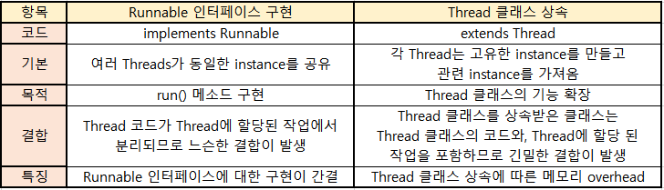

## Thread 클래스 vs Runnable 인터페이스
- `Thread 클래스`를 상속하거나, `Runnable 인터페이스`를 구현하여 만든 스레드의 `run()` 메소드의 실행 방식과 성능은 동일하다.
- Thread 클래스 또한, Runnable 인터페이스를 상속받아 구현한 클래스이다.

- 따라서, `Thread 클래스의 기능 확장`을 원하는 경우에만 `Thread 클래스`를 상속받고, `단순히 run() 메소드를 구현`하는 목적이라면 `Runnable 인터페이스`를 상속받는 것이 좋다.

## run() vs start()
- `start()` 메소드는 내부에 `run()` 을 호출하도록 구현되어있다.
- Thread 클래스의 `run()` 메소드를 실행하는 것은, 단순히 오버라이딩한 run() 메소드를 호출하는 것이다.
    - 즉, main thread에서의 stack 영역을 차지하여, 각각 메소드가 `순차적으로 진행`된다.
- `start()` 메소드를 실행하면, JVM이 각 thread마다 고유의 stack 영역을 할당해주기 때문에, run() 메소드 호출과 달리 `독립적으로 동작`하게 된다.
    - 호출 스택(call stack)이 2개 이상일 때, 스케줄러에 의해 호출 스택에 들어있는 메소드가 번갈아(concurrently) 실행된다.